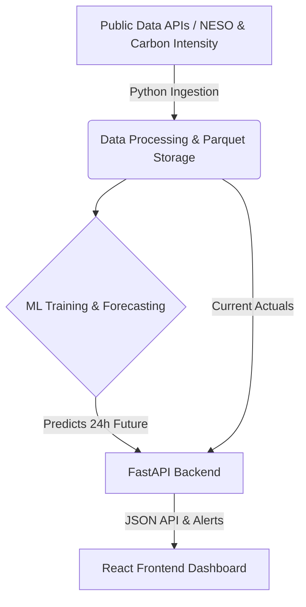

# 🌍 EcoShift

**Energy & Carbon Emissions Tracking Dashboard**

EcoShift is a full-stack platform designed to help facilities monitor their energy consumption and carbon footprint in real-time. By integrating actual telemetry data with Machine Learning (ML) forecasts, EcoShift provides proactive alerting and intuitive visualizations to drive sustainable operations.

---

## 🏛 Architecture

EcoShift is structured as a monorepo, cleanly separating the Python FastAPI backend from the React + Vite frontend.



## 📜 API Contract

The unified API endpoint (`/api/v1/metrics/timeseries`) returns data in a structured JSON schema:

```json
{
  "metadata": {
    "device_or_site_id": "site_001",
    "timezone": "UTC",
    "range_start": "2026-03-10T12:00:00Z",
    "range_end": "2026-03-11T12:00:00Z",
    "units": {
      "energy_draw": "kWh",
      "carbon_emissions": "kgCO2"
    }
  },
  "timeseries": [
    {
      "timestamp": "2026-03-10T12:00:00Z",
      "energy_draw": { "actual": 120.5, "predicted": 118.2 },
      "carbon_emissions": { "actual": 54.2, "predicted": 53.1 }
    }
  ],
  "active_alerts": [
    {
      "alert_id": "alt_20260310130000",
      "timestamp": "2026-03-10T13:00:00Z",
      "type": "PEAK_GRID_DRAW",
      "severity": "CRITICAL",
      "threshold_value": 250.0,
      "triggered_value": 260.5,
      "message": "Peak grid draw exceeded the 250 kWh maximum threshold."
    }
  ]
}
```

## ⚙️ Local Setup Instructions

You can quickly spin up both the backend and frontend using the unified setup and start scripts.

1. **Clone the repository:**
   ```bash
   git clone <repo-url>
   cd ecoshift
   ```

2. **Run the unified start script:**
   Ensure you have Python 3.9+ and Node.js 18+ installed.
   ```bash
   chmod +x run_all.sh
   ./run_all.sh
   ```
   *Note: This script will install backend dependencies in a virtual environment, install frontend NPM packages, and seamlessly start both development servers concurrently.*

   - **Backend API:** `http://localhost:8000` (FastAPI Swagger docs at `/docs`)
   - **Frontend UI:** `http://localhost:5173`

## 🚀 Deployment Guide

The project is configured for automated deployment via CI/CD to modern PaaS providers:

### Backend (Render)
- The backend is configured to deploy to **Render** entirely via the included `render.yaml` infrastructure-as-code file.
- It uses Uvicorn to serve the FastAPI application natively.
- Scheduled tasks (cron jobs) are predefined to trigger data ingestion and model retraining hourly and weekly.

### Frontend (Netlify)
- The React SPA is designed to quickly deploy to **Netlify** or Vercel.
- **Build Command:** `npm run build`
- **Publish Directory:** `dist`
- Ensure you set the `VITE_API_URL` environment variable in your Netlify dashboard to point to the live Render backend URL.
